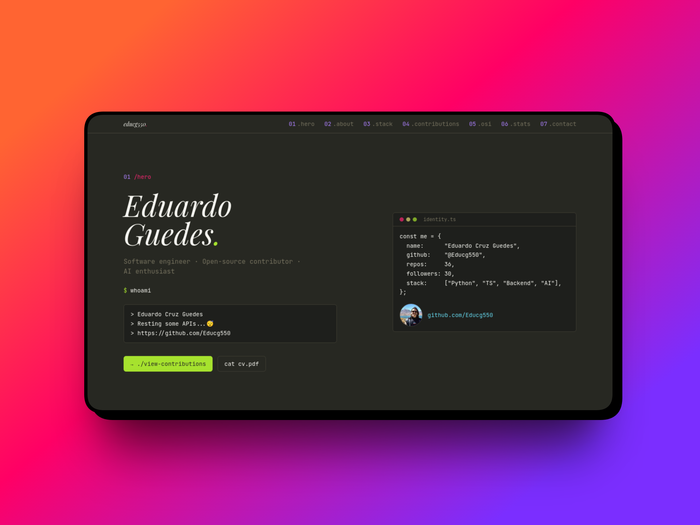

# My Website

My personal website: a Monokai-themed Next 16 SPA showcasing OSS contributions, solo initiatives and general portfolio.


<sub>Available at https://educg550.vercel.app/</sub>

## Stack
Next 16 (App Router, RSC) · TypeScript · Tailwind v4 · Biome · npm · motion · `@vercel/analytics`.

## Local development

```bash
npm install
cp .env.example .env   # then fill in GITHUB_TOKEN
npm run dev
```

## Commands
- `npm run dev` - start the dev server
- `npm run build` - production build
- `npm run lint` - Biome lint
- `npm run format` - Biome format (write)

## Deployment

Hosted on [Vercel](https://vercel.com); production tracks `main`, PRs get preview URLs automatically.

**Day-to-day**
- Push to `main` -> Vercel builds & promotes to production.

CLI alternative: `npx vercel` (preview), `npx vercel --prod` (production).
